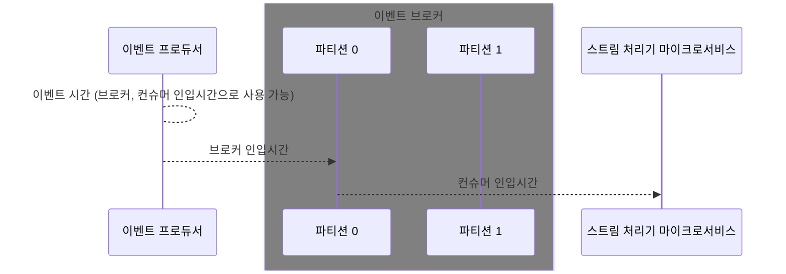

# 6. 확정적 스트림 처리

이벤트 기반 마이크로서비스는 2가지 주된 처리방식이 있다.

1. 이벤트를 실시간에 가깝게 처리하기, 실행 시간이 긴 마이크로서비스가 적합
2. 과거부터 이벤트를 처리해서 현재까지 따라잡는 캐치업(catch-up) 방식, 규모가 작은 신규 서비스에 적합

어떻게 이벤트를 처리한다 해도, 완벽하게 확정적인 처리는 불가능하기 때문에 상황에 맞는 ‘최선의’ 방식을 취해야 한다. 이러한 방식을 취하기 위한 사전개념은 다음과 같은 것들이 있다.

### **타임스탬프**

- 이벤트 스트림의 이벤트는 오프셋과 타임스탬프를 모두 갖고 있다. 이 정보들을 기반으로, 이벤트의 처리 시점의 선후 관계를 알아낼 수 있다.



### 이벤트 스케줄링

이벤트를 일관되게 처리해야 확정적인 처리 결과를 재연할 수 있다. 스케줄링은 여러 입력 파티션에서 이벤트를 소비할 때 다음에 처리할 이벤트를 선택하는 프로세스이다.

정확한 결과를 얻기 위해서는 파티션을 무시하고 **레코드에 기록된 이벤트 시간에 따라** 처리 순서를 정확하게 간섭해야 한다. 전체 입력 파티션에서 다운스트림에 오래된 순으로 전달하는 것이 일반적인 스케줄링 방법이다.

실무적으로는 **로컬 시스템(프로듀서 인스턴스)이 할당한 이벤트 시간이 가장 정확하다.** 다만, 신뢰도가 낮다면 이벤트 브로커에 인입된 시간을 사용하는게 최선이다.

### 워터마크

이벤트 시간의 진행 상황을 추적하여 동일한 처리 토폴로지 안에서 T 시간 이전의 처리 완료 신호를 다운스트림 노드에 알리는 신호이다. 이는 의존관계의 다른 노드에도 차례로 전파한다.

- **병렬 처리 시 워터마크**
    
    워터마크를 통해 독립적인 컨슈머 인스턴스 간 이벤트 시간을 병렬적으로 조정할 수 있다.
    
    ```mermaid
    flowchart LR
        A0[T=1]--"W(1) X-키,1-타임스탬프"-->B0[T=2]
        A1[T=11]--"W(11) X,11"-->B1[T=22]
        B0--"W(2) Y,2 (전파)"-->C0[T=3]
        B1--"W(22) B,22"-->C1[T=33]
        B0--"W(2) Z,2 (전파, 지각 이벤트)"-->C1
    ```
    

### 스트림 시간

이벤트 스트림 시간은 하나 이상의 이벤트 스트림에서 이벤트를 읽는 컨슈머 애플리케이션이 해당 토폴로지의 가장 최근에 처리된 이벤트의 타임스탬프(스트림 시간)를 유지한다. 컨슈머 인스턴스는 할당된 이벤트 스트림의 각 파티션에서 이벤트를 받아 버퍼링하고 이벤트 스케줄링 알고리즘을 적용해서 다음의 이벤트를 선택한다. 입력을 받아 스트림 시간은 이전보다 클 경우 업데이트 하고 줄어들지 않는다.

워터마크 방식이 노드가 직접 버퍼링하는 방식이면 스트림 시간 방식은 깊이 우선 방식으로 인해 하위 토폴로지에서 한번에 하나의 이벤트만 처리하는 방식이라는 점에서 근본적인 차이가 있다.

### 비순차 이벤트와 지각 이벤트

이벤트 스트림에서 이벤트를 처리하다 보면 반드시 타임스탬프 순서가 안맞는 경우가 발생하고 이것을 비순차 이벤트라고 한다. 이런 비순차 이벤트를 비즈니스 요건에 따라 처리할 지 먼저 파악한 후, 마이크로서비스를 확장성 있게 설계해야 한다.

- 이벤트 처리방식에 따른 시간이 늦은 이벤트의 경우
    - 워터마크 - 이벤트 AA 가 워터마크 W(A) 이후에 도착하면 늦은 것이기 때문에 해당 노드가 알아서 처리
    - 스트림 시간 - 이벤트 AA 가 스트림 시간 AA 만큼 증가한 이후에 도착하면 늦은 것으로 간주하고 하위 토폴로지가 알아서 처리한다.
- **비순차 이벤트의 원인과 영향**
    - 비순차 데이터에서 소싱
    - N 개의 프로듀서가 M 개의 출력 파티션 으로 이벤트를 쓰기
- **타임스탬프 별로 이벤트 윈도잉하기**
    - 특정 시간대에 어떤 키를 가진 이벤트를 대상으로 발생한 일을 파악하기에 유용하다. 윈도잉에 사용되는 시간은 보통 이벤트 시간을 많이 사용한다.
        - 텀블링 윈도 - 고정된 크기 및 겹치지 않는다. 시간을 명확하게 정해서 발생한 일을 파악할 수 있다.
        - 슬라이딩 윈도 - 고정된 크기 및 일정 슬라이드 단위로 겹친다. 지난 시간의 단위로 일을 파악할 수 있다.
        - 세션 윈도 - (사용자, 활동 시간) 별로 그룹핑 하는 윈도우 방식이다. 특정 사용자의 어떤 활동 세션동안에 일어난 일을 파악할 수 있다.
