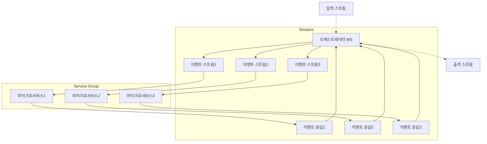

# 8. 마이크로서비스 워크플로 구축

마이크로서비스의 워크플로를 구축하기 위해 고려할 사항은 다음과 같은 것들이 있다.

- 워크플로의 생성 과 수정
    - 서비스간의 연관 관계
    - 워크플로 수정 시 무중단 수정
- 워크플로 모니터링
- 분산 트랜잭션 구현

이러한 문제의 해결을 위한 몇가지 패턴이 있다.

### 코레오그래피 패턴 (리액티브 아키텍처)

고도로 분리된 마이크로서비스 아키텍처를 일컫는다. 이벤트 기반 마이크로서비스 아키텍처에 가장 잘 어울리는 방식으로, 모든 업스트림 프로듀서와 다운스트림 컨슈머는 모두 느슨하게 연결되어 차단없이 완전히 독립적이다.

- 워크플로의 생성 과 수정
    - 코레오그래피 패턴 에서는 서비스가 스트림과 연결되어 다른 서비스로 이벤트를 전파한다. 하나의 이벤트를 끝점에 추가하는 것은 간단하지만, 중간 단계를 추가하는 경우에는 다소 복잡해지고 취약하진다.
- 워크플로 모니터링
    - 이벤트 스트림의 독립성과 서비스들이 완전히 분산되어 있기 때문에, 독립적인 서비스 전체에 걸친 하나의 비즈니스 로직의 범위를 모니터링 하려면 실패 예외를 고려하여 상태 저장소로 구체화 해야 한다.

### 오케스트레이션 패턴

API Gateway 와 비슷한 방식으로, 중앙집중화된 오케스트레이터 마이크로서비스를 두어 입/출력 스트림을 조정하는 역할을 수행하게 한다. 오케스트레이터의 역할은 워크플로에 한하며, 하나의 스트림이 성공했는지? 에 관심을 가지게 된다.

위와 같이 오케스트레이터가 직접 마이크로서비스에 요청-응답을 RPC 등을 수행하여 출력 스트림으로 내보낸다.

이벤트 스트림 도구를 사용하지 않기 때문에 오버헤드가 적고 속도가 빠른 것이 특징이지만, 네트워크 문제 등을 알아서 처리해 주어야 한다. 외부 서비스를 연동하면 요청-응답 패턴은 거의 필수적으로 섞어서 사용하게 된다.

- 워크플로의 생성 과 수정
    - 오케스트레이션 패턴에서는 요청-응답 결과를 구체화하여 워크플로의 이벤트를 추적할 수 있다. 그렇기 때문에 오케스트레이터가 모든 워크플로 정의를 가지고 있어야 하며 서비스 간의 관계를 명확히 정의해야 한다. 또한 워크플로를 오케스트레이션 하는 역할에만 집중해야 한다.
- 워크플로 모니터링
    - 서비스들과 단단하게 결합되어 구체화 상태를 가지고 있기 때문에 간단한 쿼리로 이슈를 파악하기 쉽고 로그를 관리하기도 쉽다.

### 분산 트랜잭션 *

여러 서비스 간에 걸쳐있는 트랜잭션을 의미한다. 이러한 트랜잭션의 **이행-역전** 로직은 하나의 마이크로서비스가 관리해야 새 트랜잭션의 시작을 막을 수 있고 관리할 때도 필요하다. 이런 트랜잭션을 구현하는 몇가지 패턴이 있는데 그 중에서도 가장 잘 알려진 것은 **사가 패턴(Saga Pattern)** 이 있다.

- 사가 패턴(Saga Pattern)
    - 각 서비스의 트랜잭션을 사가(Saga)라는 단위로 분류하며, 각 트랜잭션은 스스로 롤백이 가능해야 한다.
    - **코레오그래피 트랜잭션**
        - 이벤트 스트림간 연결할때는 순서가 중요하기 때문에 중간에 스트림이 실패할 경우 **워크플로를 역전시켜야 한다.** 역전 이벤트를 발행하거나 이전 서비스의 요청에 응답하는 방법이 있다.
    - **오케스트레이션 트랜잭션**
        - 스트림 도구를 사용하지 않고 요청-응답으로 워크플로를 처리하기 때문에 오케스트레이터에서 각 서비스가 제공하는 역전 이벤트를 위한 액션을 실행하며 워크플로를 역전시킨다. 상태가 구체화되어 있어 어느 시점에라도 워크플로를 중단하거나 역전하기 수월하다.
