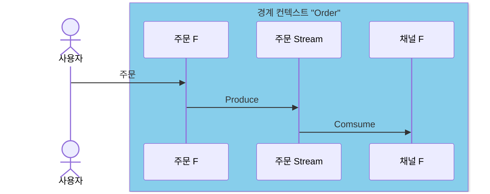

# 9. FaaS 응용 마이크로서비스

### FaaS?

서비스로서 작동하는 함수를 의미하며, **서버리스(Serverless)** 솔루션으로 불리고, 또한 **BPC(Basic Producer and Consumer - 기본 프로듀서/컨슈머)** 로 생각할 수 있다. 인프라를 별도로 관리할 필요가 없고, 배포 및 확장에 자유롭다. 함수(Function)는 트리거가 발생하면 실행되는 코드 조각이다. 함수가 실행되고 작업이 완료되거나, 정해진 시간이 경과하면 종료된다.

### 함수 기반 서비스를 마이크로서비스로 구축하기

함수 서비스를 마이크로서비스로 사용하려면 소속될 경계 컨텍스트를 명확히 해야 한다. 즉, 경계 컨텍스트는 하나지만, 함수 서비스는 여러 개가 속할 수 있다. (경계 컨텍스트 1 : N 함수)

경계 컨텍스트 끼리 연결 시에는 요청-응답 혹은 이벤트로 주고 받는 인터페이스를 구축한다.

이벤트를 함수가 **처리 완료 후** 오프셋 등 완료에 대한 커밋(Commit)을 수행해야 한다. 이것은 이벤트 1회당 1회 처리 완전 보장을 위함이다. 함수로 이벤트를 전달 후 바로 커밋을 하는 경우는 데이터 손실에 민감하지 않은 서비스가 주로 사용하는 방법이다.

### 함수 서비스의 구성 요소

- 함수
- 입력 이벤트 스트림 (like Event[])
- 트리거 로직
- 메타데이터를 사용한 에러 및 확장 정책
    - 메타데이터 속성
        - 컨슈머 그룹, 컨슈머 프로퍼티(배치 설정 정보), 재시도/에러 정책, 확장 정책

### 콜드 스타트 / 웜 스타트

함수 서비스의 주요한 특징 중 하나가 휴식기에서 깨어날 때 일련의 연결 과정을 거친 후 웜 상태로 전환한다는 것이다. 그리고 웜 상태에서 작업 완료 혹은 일정 시간 후 다시 동면기로 들어간다. 이러한 특징으로 인해 초기 실행이 늦어져 성능이 낮아질 수 있다는 단점이 존재한다.

### 함수 시동을 위한 트리거 방법

서비스 제공사에 따라, 컨슈머 통합 솔루션을 제공하기도 하고 비 FaaS 서비스를 위한 지원이 있는 경우도 있다.

- **새 이벤트에 반응해 트리거 (이벤트 - 스트림 리스너)**
    - [AWS SNS 와 Lambda 를 사용](https://docs.aws.amazon.com/ko_kr/lambda/latest/dg/example_serverless_SNS_Lambda_section.html)하면 SNS 브로커가 Lambda 를 트리거 할 수 있다. 이렇게 솔루션 제공사가 자사 함수 서비스를 사용하는 사례를 위해 컨슈머 통합 플랫폼을 제공하는 경우가 많다.
    - 서버리스 플랫폼은 결코 저렴하지 않기 때문에 **배치 크기, 배치 윈도** 속성을 사용하며 처리할 이벤트의 규모와 대기 시간을 조정하여 비용을 절감할 수 있다.
- **컨슈머 그룹 랙에 반응해 트리거**
    - 컨슈머 그룹 오프셋을 주기적으로 폴링해서 현재 컨슈머 오프셋과 헤드 오프셋 간의 차이를 계산해 랙을 감지하는 방법이다.
- 스케줄링을 사용해 트리거 (스케줄러가 스트림을 폴링)
- 웹훅에 반응해 트리거
- 리소스 이벤트에 반응해 트리거

### 함수 서비스 사용시 유의할 것

- 동시성, **확정성** 이 주요 요건이 아닐 경우에 적합 (일관성, 정확성을 맞추기 복잡하고 어렵기 때문)
- 함수 서비스에서 로직을 처리하기 위한 **상태를 보관하려면** **외부 저장소**를 사용해야 한다.
- 여러 종류의 이벤트를 처리하는 함수를 사용한다면, 리소스를 넉넉히 책정하는 것이 권장된다. 이벤트마다 처리량의 차이가 있기 때문에, 함수 스펙을 너무 낮게 설정하면 성능이 오히려 나빠질 수 있다.

### 함수에서 함수 호출 연계하기

- 이벤트 기반 함수 호출
    - 함수에서 이벤트를 발행하고, 다른 함수가 이벤트 스트림을 리스닝하고 있다가 컨슘하여 로직을 처리한다. 일반적인 이벤트 기반 코레오그래피 패턴이다.
- 함수 → 함수 직접 호출
    - 함수에서 이벤트로 트리거 되고, 함수가 함수를 직접 호출할 수도 있다. 이때 **비동기로 호출할 경우 처리가 완료되어야만 오프셋이 정상적으로 업데이트 되고**, 그렇지 않으면 아무런 반응을 얻을 수 없어 이벤트 순서가 꼬일 수 있다. 그렇기 때문에 **순서가 중요하지 않은 이벤트에 적합**하고, 꼭 함수로 사용해야 한다면 **오케스트레이션 패턴으로 동기 호출**을 고려해 볼 수 있다.
